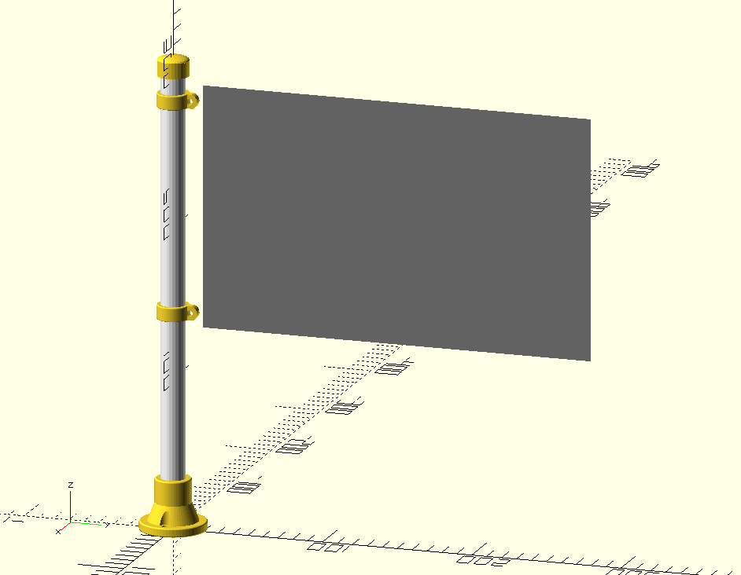
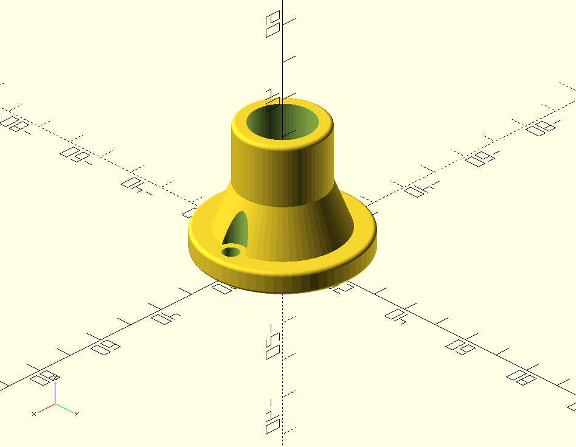
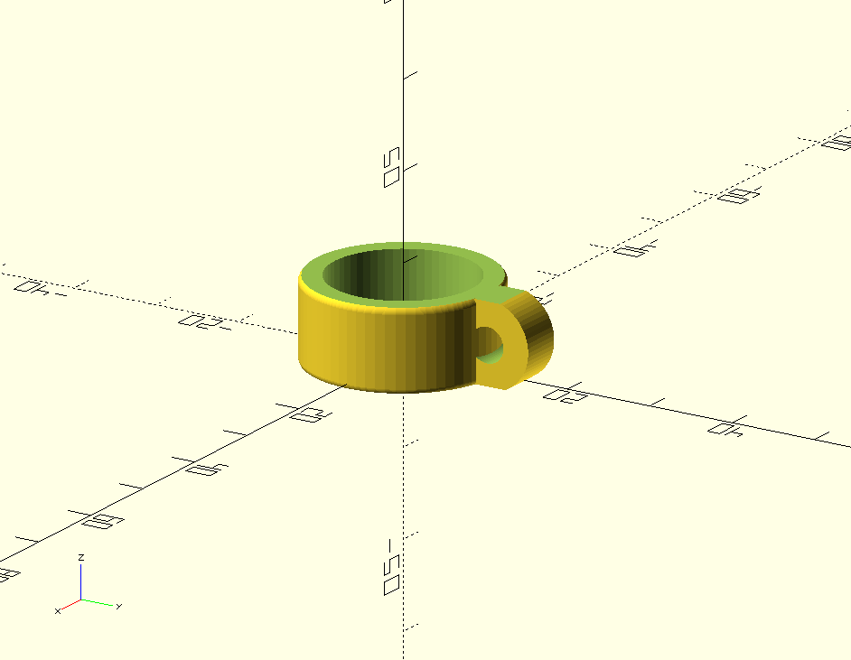
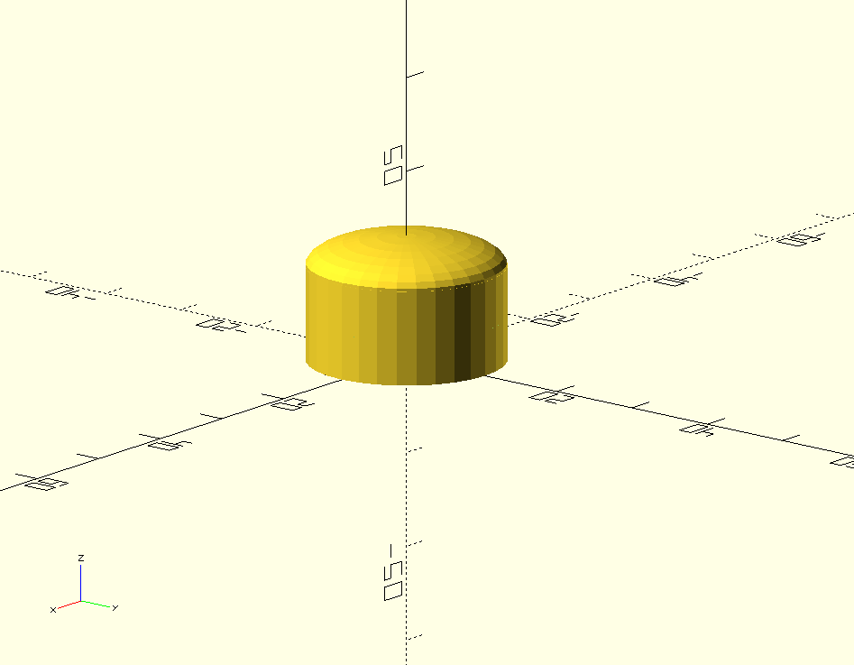

# HackFlag 

## Objective

The "HackFlag Forge" project aims to design and create bespoke 3D-printed components for constructing a unique flagpole for my boats and my hacker club. 

By leveraging cutting-edge digital fabrication techniques, including 3D modeling and printing, the project seeks to craft a robust and visually striking flagpole that reflects the ethos and identity of the hacker community.

## 3D Parts

The design process involves meticulous attention to detail, incorporating elements of technology, innovation, and creativity. Each component is meticulously crafted to ensure structural integrity while allowing for customization and personalization. The use of advanced materials and manufacturing methods ensures durability and longevity, suitable for both indoor and outdoor settings.

This project contains 3 parts:

**Flag Base** - Base for fitting the mast and screwing onto any surface.

**Flag Hook** - Piece to serve as a hook for the tip of the flag, we need two of these.

**Flag Cap** - Mast Tip

## Flag Designs

Through collaboration and iteration, the HackFlag project strives to deliver a final product that not only meets the functional requirements of a flagpole but also serves as a symbol of the hacker club's values and aspirations. 

From concept to completion, every step of the process embodies the spirit of hacking and craftsmanship, culminating in a one-of-a-kind flagpole that stands as a testament to the power of the hacker community.
